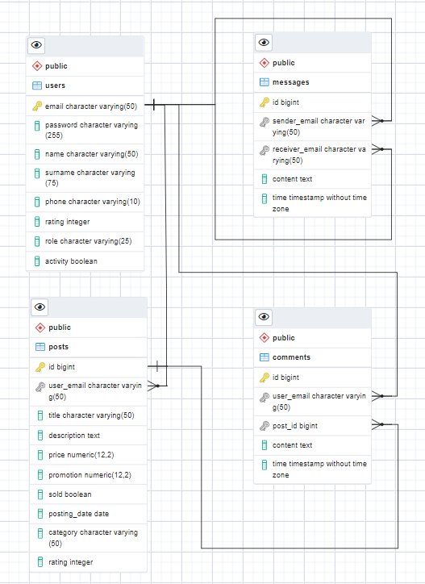

# SENLA_project
Финальное задание курсов Java-разработки от ООО "SENLA"
RESTful web-проект для размещения частных объявлений
# Содержание
- **Структура проекта**
- **Схема БД**
- **Сборка, запуск и остановка проекта**
## Структура проекта
- **docker** - содержит все фалы, необходимые для запуска Docker-контейнеров
- - **app/** - содержит Dockerfile и .jar-архив приложения
- - **sql/** - содержит SQL-скрипты для создания таблиц и заполнения их строками
- - **dicker-compose.yml**
- **src** - содержит все основные файлы
- - **main/.../config/** - содержит файлы конфигурации
- - **main/.../controller/** - содержит rest-контроллеры приложения
- - **main/.../dto/** - содержит объекты-обертки для контроллеров
- - **main/.../exception/** - содержит исключения
- - **main/.../mapper/** - содержит mapper-классы для обновления полей сущностей
- - **main/.../model/** - содержит классы-сущностей
- - **main/.../repository/** - содержит репозитории
- - **main/.../security/** - содержит классы для работы с JWT-токенами
- - **main/.../service/** - содержит классы-сервисы
- - **log/** - содержит логи приложения
- - **test/** - содержит unit-тесты
- **project control** - содержит скрипты для сборки, запуска и остановки приожения
- - **init.sh** - скрипт сборки jar-архива приложения
- - **run.sh** - скрипт запуска приложения
- - **shutdown.sh** - скрипт остановки приложения
## Схема БД

## Сборка, запуск и остановка проекта
Все необходимые скрипты для управления приложением находятся в папке проекта. Для сборки приложения нужно запустить скрипт `init.sh`. Для запуска приложения используется скрипт `run.sh`. И для остановки приложения используется скрипт `shutdown.sh`